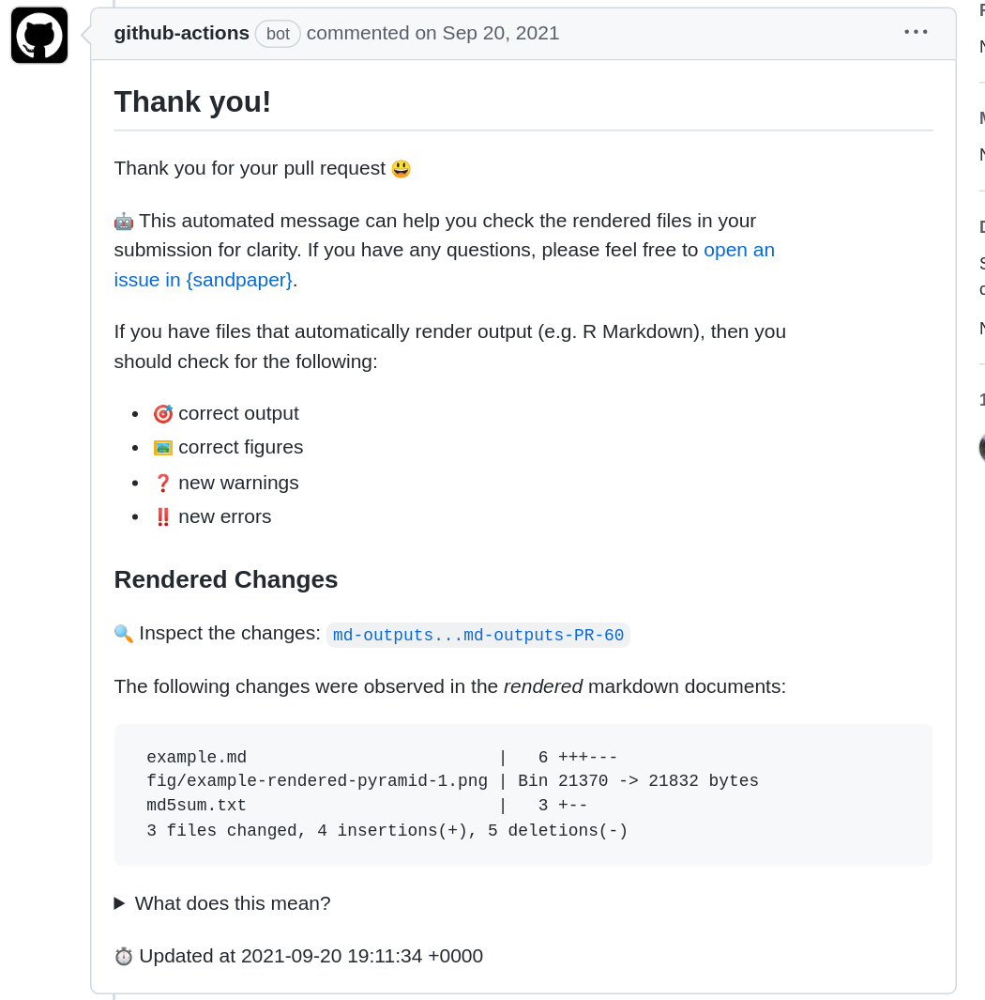
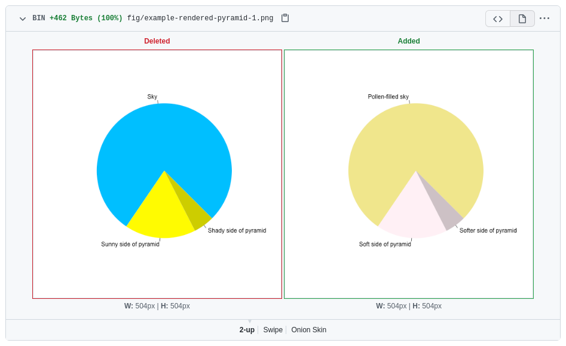
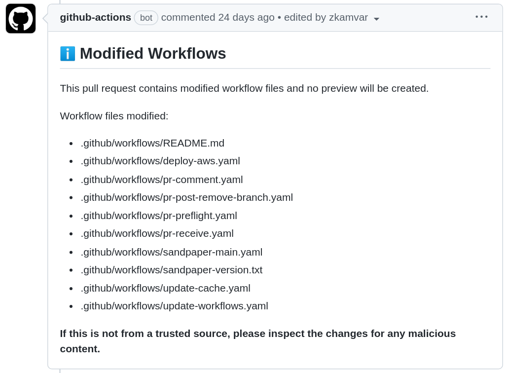

::::::::::::::::::::::::::::: questions

 - What happens during a pull request?
 - How do I review generated content of a pull request?
 - How do I handle a pull request from a bot?

:::::::::::::::::::::::::::::::::::::::

::::::::::::::::::::::::::::: objectives

 - Identify key features of a pull request to review
 - Identify the benefits of pull request comments from a bot
 - Understand why bots will initiate pull requests
 - Understand the purpose of automated pull requests

::::::::::::::::::::::::::::::::::::::::

:::: callout

#### :construction: Under Development

This episode is still actively being developed

::::

## Introduction

One of the biggest benefits of working on a Carpentries Lesson is that it gives
maintainers and contributors practice collaboratively working on GitHub and 
practicing common software engineering practices, including pull requests and
reviews. In the Carpentries Workbench, we have implemented new 
features that will make reviewing contributed content easier for maintainers:

1. Source content is checked for valid headings, links, and images
2. Generated content is rendered to markdown and placed in a temporary branch
   for visual inspection.
3. Pull requests are checked for malicious attacks. 

## Reviewing A Pull Request

When you recieve a pull request, a check will first validate that the lesson can
be built and then, if the lesson can be built, it will generate output and leave
[a comment that provides information about the rendered
output](https://github.com/carpentries/sandpaper-docs/pull/60#issuecomment-923204714):

<!-- NOTE: 
To generate this screenshot, use the webshot2 package:

library(webshot2)
shoot <- function(file = 'bot-comment', repo = "caprentries/sandpaper-docs", pr = 60, comment = "#issuecomment-923204714") {
   webshot(glue::glue("https://github.com/{repo}/pull/{pr}{comment}"), 
     file = glue::glue("episodes/fig/pr-{file}.png"), 
     selector = comment, 
     expand = c(10, 10, 10, 80)
   )
}
-->

{alt="Screenshot of GitHub bot comment informing you 
the message is automated, that you should check for accuracy of rendered output,
and that there were 3 files changed in the rendered markdown documents."}

With this information, you can click on the link that says 'Inspect the changes'
to navigate to a diff of the rendered files. In this example, we have 
manipulated the output of a plot, and GitHub allows us to visually inspect these
differences by scrolling down to the file mentioned in the diff and clicking on 
the "file" icon to the top right, which indicates to "display the rich diff".

{alt="Screeshot of a GitHub rich diff showing two versions
of a pyramid, one with a blue sky and yellow pyramid and the other with a yellow
sky and lavender pyramid."}

Of course, if you have a rendered lesson, another important thing is to check to
make sure the outputs continue to work. If you notice any new errors or warnings
new in the diff, you can work with the contributor to resolve them.

::::: discussion

### Risk Management

Accepting generated content into lessons from anyone runs the risk of a security
breach by exposing secrets. To mitigate this risk, GitHub limits the scope of
what is possible inside a pull request so that we can check and render the 
content without risk of exploitation. Through this, we render and check the 
lesson inside the pull request with no privileges, check that the pull request
is valid (not malicious), and then create a temporary branch for an exploratory
preview, allowing the maintainer to audit the generated content before it gets
adopted into the curriculum. 

If the PR is invalid (e.g. the contributor spoofed a separate, valid PR, or
modified one of the github actions files), then the maintainer is alerted that
the PR is potentially risky.

{alt="Workflow
diagram from a pull request starting from Pull Request, and going to a path
involving validation, artifact creation, maintainer review, and potential
deployment."}

:::::

## Automated Pull Requests

There are two situations where you would receive a pull request from [The 
Carpentries Apprentice bot](https://github.com/znk-machine/)

1. The workflows need to be updated to the latest versions
2. You have a lesson that uses generated content, the software requirements file
   (e.g. renv.lock or [future] requirements.txt) is updated to the latest
   versions and the lesson is re-built.

More details about the purpose of these builds can be found in [The Chapter on
updating lesson components](update.md).

::: callout

### For Lessons Outside of The Carpentries

If you are using {sandpaper} to work on a lesson on your own personal account,
these pull requests may never trigger. If you want them to work, follow the 
instructions in the technical article in {sandpaper} called [Working with
Automated Pull Requests].

:::


### Workflow Updates

When you receive a workflow update pull request, it will state that it is a bot
and then indicate which version of sandpaper the workflows will be updated to.

{alt="Screen shot of the bot commenting that 
it is an automated build and that it is updating workflows."}


Because this PR contains changed workflow files, it will be marked as invalid
no preview will be created, rendering a comment that indicates as such.

{alt="Screen shot of the github-actions bot
commenting with 'Pull Request contains modified workflows; no preview will be 
created.'"}


### Updating Package Cache

Updates to the package cache are accompanied by a bot comment that indicates the
package versions that have been updated.

{alt="Screen shot of the apprentice bot 
commenting that package versions have been updated in the lesson (e.g. knitr
version changing from 1.33 to 1.34). It indicates that a comment will appear in
a few minutes to show what has changed."}

You will notice at the bottom of the comment there are instructions for how to
check out a new branch and inspect the changes locally:

```bash
git fetch origin update-7-packages-2021-09-11
git checkout update-7-packages-2021-09-11
```

You are free to push code changes to this branch to update any lesson material
that has changed due to package updates or you can also pin the versions of the
packages you do not want updated.

:::::::::::::::::::::::::::::: keypoints

- Pull requests for generated formats requires validate of prose and generated content
- Inspecting the rendered markdown output can help maintainers identify changes that occur due to software before they are deployed to the website
- Automated pull requests help keep the infrastructure up-to-date

::::::::::::::::::::::::::::::::::::::::


[rmd-blog]: https://software-carpentry.org/blog/2016/07/rmarkdown-new-template.html
[r4-migration]: https://carpentries.org/blog/2020/08/r-4-migration/
[gh-workflows]: https://docs.github.com/en/actions/ 
[{sandpaper}]: https://carpentries.github.io/sandpaper
[pandoc]: https://pandoc.org/
